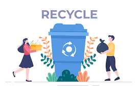

# Efficient Waste Classification with ResNet34: Leveraging Transfer Learning for Accurate Results



## Introduction
Waste management is a critical global issue, affecting environmental sustainability, public health, and resource conservation. As urban populations grow and consumption patterns change, efficient waste sorting and recycling become increasingly important to minimize landfill waste and maximize resource recovery.

The `Efficient Waste Classification with ResNet34` project addresses this challenge by harnessing the power of advanced computer vision techniques and transfer learning. By leveraging a pre-trained ResNet34 model, this solution enables accurate and efficient classification of waste materials into distinct categories, such as organic and recyclable. This automated approach not only enhances sorting precision but also streamlines waste management processes.

## Overview
In this project, we use a pre-trained ResNet34 model, originally trained on a large dataset, and fine-tune it for our specific image classification task. We modify the final classification layer to suit binary classification and evaluate the model's performance on a test dataset. This approach leverages the model's pre-learned features to efficiently classify new images.

## Features
- **Pre-trained Model:** Utilize ResNet34, a deep residual network known for its accuracy and efficiency.
- **Custom Classification:** Adapt the model for binary classification by replacing the final layer.
- **Inference Script:** A ready-to-run script for making predictions on new images.

## Installation

1.  **Clone the repository**: Open the terminal and run the following command:

```         
git clone git@github.com:s-voon/waste_classification.git
```

Navigate to the directory of the cloned repository.

2.  **Create environment**: Navigate to the directory where the environment.yaml file is located on your terminal and run the following command:

```         
conda env create -f environment.yaml
conda activate waste_org
```

## Usage

- For detailed, step-by-step instructions on how to train the model and use it for inference, please refer to the notebook directory.

- To make predictions using the trained model from the terminal, run the following command:
```bash
python src/predict.py IMAGE_PATH
```

## Contributing Guidelines

Interested in contributing? Check out the [contributing guidelines](CONTRIBUTING.md). Please note that this project is released with a [Code of Conduct](CODE_OF_CONDUCT.md). By contributing to this project, you agree to abide by its terms.

## License

The project is licensed under the terms of the [MIT license](https://github.com/s-voon/waste_classification/blob/main/LICENSE).
